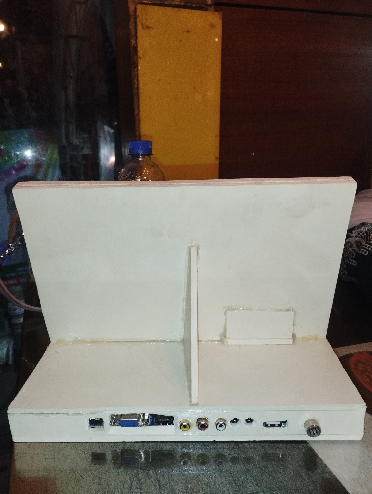
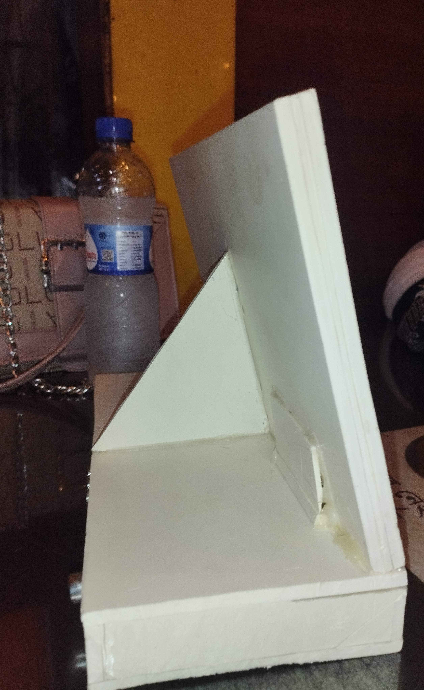
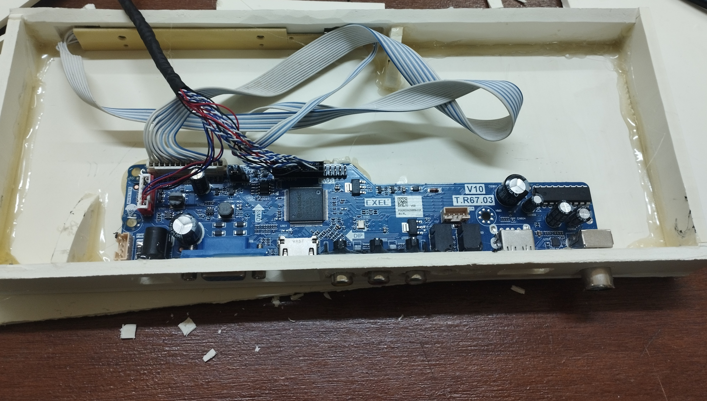
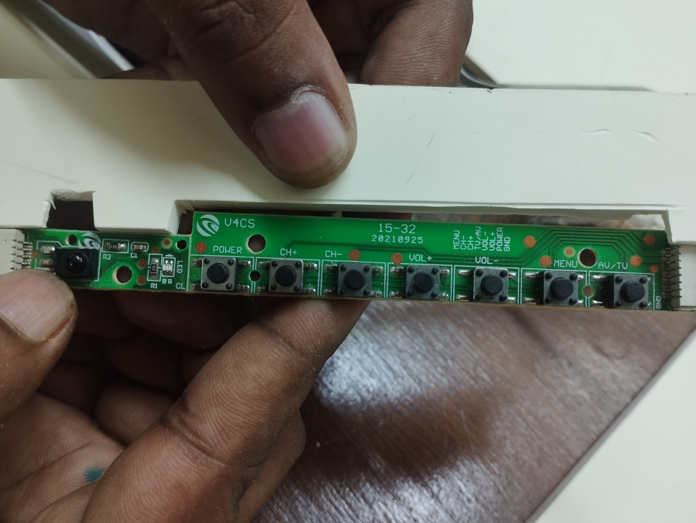

# Design and Development of a Portable Monitor

A low-cost portable monitor prototype developed for the **EEE 406: Microprocessor and Embedded System Laboratory** course at the University of Asia Pacific.

## Project Overview

This project presents the design, hardware integration, enclosure fabrication, assembly, troubleshooting, and functional testing of a portable monitor prototype.

The prototype was developed by integrating an LCD display panel with a compatible display controller board, an external DC power adapter, physical on-screen display control buttons, and a custom enclosure fabricated from PVC board.

I personally completed the main practical work of this project, including hardware integration, internal connection arrangement, external shape design, PVC-board enclosure fabrication, component mounting, final assembly, troubleshooting, and output testing.

A few individuals provided occasional assistance during component procurement, handling, troubleshooting, and the initial preparation of the project documentation.

## Personal Contribution

My main contributions to this project include:

- Selection and integration of the LCD panel and compatible display controller board
- Arrangement of the internal signal and power connections
- Design of the external shape and support structure
- Fabrication of the enclosure using PVC board
- Mounting of the LCD panel, controller board, and OSD button board
- Cutting and alignment of the input/output port openings
- Hardware troubleshooting and repeated fitting
- First power-on and final display-output testing
- Technical review and correction of the final documentation
- Preparation and organisation of this GitHub repository

## Objectives

- To design and build a functional portable monitor prototype
- To interface an LCD panel with a compatible display controller board
- To develop a lightweight and low-cost enclosure using PVC board
- To keep the physical OSD controls and input/output ports accessible
- To test power-on operation, video-input detection, display output, and mechanical stability
- To calculate the recorded prototype cost
- To identify possible improvements for future development

## Project Scope

This project focuses on:

- Hardware selection and compatibility testing
- Display-controller integration
- Internal connection arrangement
- Enclosure design and fabrication
- Hardware assembly
- Basic functional testing
- Prototype cost analysis
- Technical documentation

This prototype does not include:

- Custom embedded firmware
- Backend or cloud software
- An internal rechargeable battery
- A battery-management system
- Formal electrical or safety certification
- Commercial production readiness

The exact LCD panel model, native resolution, refresh rate, weight, and manufacturer specifications should be verified from the panel label or official datasheet before commercial development.

## Main Features

- Functional LCD display output
- Compatible multi-input display controller board
- HDMI video input
- External DC power supply
- Physical OSD control buttons
- Brightness and contrast adjustment
- Power, menu, channel, volume, and input-selection controls
- Custom PVC-board enclosure
- Accessible input/output ports
- Rear mechanical support
- Low-cost and repairable construction
- Portable proof-of-concept design

## Design Requirements

| ID | Requirement | Design Response |
|---|---|---|
| R1 | Functional display output | The monitor displays an image from a compatible source device. |
| R2 | Low prototype cost | Affordable and locally available components were used. |
| R3 | Portable form | The complete unit was designed as a compact secondary display. |
| R4 | Accessible controls | Power and OSD buttons remain accessible from the front. |
| R5 | Accessible ports | Enclosure openings provide access to the controller-board connectors. |
| R6 | Mechanical support | The display and controller remain securely mounted during normal use. |

## Hardware Components and Cost

| No. | Component | Quantity | Unit Cost (BDT) | Total Cost (BDT) |
|---:|---|---:|---:|---:|
| 1 | LCD Display Panel | 1 | 1,650 | 1,650 |
| 2 | T.R67.03 Display Controller Board | 1 | 1,700 | 1,700 |
| 3 | External DC Power Adapter | 1 | 100 | 100 |
| 4 | PVC-Board Enclosure and Fabrication Materials | 1 set | 500 | 500 |
| 5 | Cables and Connectors | 1 set | 90 | 90 |
| 6 | Transportation / Conveyance | 1 lot | 800 | 800 |
|  | **Total Prototype Expenditure** |  |  | **4,840** |

The direct hardware and fabrication cost, excluding transportation, was **BDT 4,040**.

## System Block Diagram

## Working Principle

A compatible source device, such as a laptop or desktop computer, sends a video signal to the display controller board through an HDMI connection.

The display controller board processes the incoming video signal and generates the required electrical interface for the LCD panel. An external DC adapter supplies power to the controller board and display circuitry.

The OSD button board allows the user to control power, menu navigation, brightness, contrast, volume, and input selection.

The custom PVC-board enclosure protects the internal components while keeping the control buttons and input/output connections accessible.

## Hardware Integration

The hardware-integration process included the following steps:

1. The LCD panel connector type and physical dimensions were inspected.
2. A compatible display controller board was selected.
3. The LCD panel and controller board were tested before enclosure fabrication.
4. The controller board and OSD button board were positioned inside the enclosure.
5. Signal, control, and power cables were connected.
6. Internal wiring was arranged to reduce strain on the LCD connector.
7. Openings were created for the input/output ports and OSD buttons.
8. The complete monitor was connected to a computer source.
9. Power-on operation, input detection, display output, and OSD control were tested.

## OSD Control Interface

| Control | Function |
|---|---|
| Power | Turns the monitor on or off |
| CH+ | Moves upward through menu options |
| CH- | Moves downward through menu options |
| VOL+ | Increases the selected value or volume |
| VOL- | Decreases the selected value or volume |
| Menu | Opens the OSD menu or confirms a selection |
| AV/TV | Selects or cycles through available input sources |

## Enclosure Design and Fabrication

The external shape and enclosure were designed and fabricated using PVC board.

PVC board was selected because it is:

- Low in cost
- Lightweight
- Locally available
- Easy to cut and shape
- Sufficiently rigid for a prototype
- Easy to repair or modify using common tools

The approximate front dimensions recorded during development were:

- Width: approximately 28 cm
- Height: approximately 18 cm

A single uniform depth value was not used because the lower controller compartment and rear support have different depths.

The enclosure includes:

- A front bezel surrounding the LCD panel
- A lower compartment for the controller board and wiring
- A rear protective panel
- A central support structure
- Rear openings for input/output ports
- Front openings for the physical OSD controls

## Prototype Images

### Front View

The front view shows the LCD panel, PVC-board bezel, lower controller compartment, and accessible OSD control buttons.

### Back View

The back view shows the rear enclosure, central support structure, controller-board ports, power input, and other input/output interfaces.

### Side View

The side view shows the monitor thickness, lower controller compartment, rear support structure, and standing position.

## Internal Hardware Connections

The following images show the display controller board, signal cables, power connection, OSD button connection, and internal hardware arrangement.

### Internal Connection View 1

### Internal Connection View 2

## Assembly Procedure

1. Inspect the LCD panel and identify its connector type and physical dimensions.
2. Select a compatible display controller board.
3. Test the LCD panel and controller board before fabricating the enclosure.
4. Measure the panel, controller board, port positions, and OSD button-board position.
5. Prepare the front frame, lower compartment, rear panel, and support layout.
6. Cut the PVC-board pieces according to the required dimensions.
7. Create openings for the display, control buttons, power connection, and input/output ports.
8. Mount the LCD panel carefully without applying excessive pressure.
9. Install the display controller board and OSD button board.
10. Connect the LCD signal cable, OSD button cable, power cable, and video-input cable.
11. Arrange the internal wiring to reduce cable strain and interference.
12. Join the enclosure sections and install the rear support.
13. Connect the monitor to a compatible computer source.
14. Apply power and test the image, controls, ports, and mechanical stability.
15. Correct connection, alignment, and fitting problems where required.

## Development Timeline

| Period | Activity | Issue Encountered | Resolution |
|---|---|---|---|
| 1–7 June 2026 | Component procurement and compatibility search | Difficulty finding a controller compatible with the LCD panel | A suitable controller board was obtained and tested |
| 8–14 June 2026 | Enclosure planning and fabrication-method selection | The available 3D printer was smaller than the required enclosure | The enclosure was redesigned using PVC board |
| 15–20 June 2026 | Hardware installation, assembly, and troubleshooting | Connector alignment and internal spacing required repeated adjustments | The layout and cut-outs were refined through multiple fitting and testing stages |

The first successful power-on was achieved on **18 June 2026**.

## Testing and Validation

| ID | Test | Expected Result | Observed Result | Status |
|---|---|---|---|---|
| T01 | Power-on Test | The monitor should turn on | The unit powered on successfully | PASS |
| T02 | Video-Input Detection | The connected source should be detected | The connected computer source was detected | PASS |
| T03 | Display-Output Test | The LCD should display a clear image | The Windows lock screen and desktop were displayed | PASS |
| T04 | OSD Button Test | The control buttons should respond | The OSD controls remained accessible and operational | PASS |
| T05 | Connector Accessibility | Required cables should connect properly | Test cables could be connected through the enclosure openings | PASS |
| T06 | Mechanical Stability | The prototype should remain supported | The assembled prototype remained upright and stable | PASS |
| T07 | Extended Thermal Test | Temperature should remain within a safe range | Not formally measured during this project phase | NOT TESTED |

The prototype was tested as a proof of concept. Long-duration thermal testing, electrical certification, colour calibration, and complete port-by-port validation were outside the scope of this project.

## Final Display Output

### Windows Lock Screen Output

### Windows Desktop Output

## Problems Encountered and Solutions

| Problem | Effect | Solution |
|---|---|---|
| Display-controller compatibility | A suitable controller board was not immediately available | Compatibility was checked through searching and practical testing |
| Enclosure manufacturing | The intended enclosure exceeded the available 3D-printer build area | The enclosure was redesigned and fabricated using PVC board |
| Input/output port alignment | The connectors did not initially align with the enclosure openings | The openings and internal mounting positions were adjusted |
| Internal cable arrangement | The panel and OSD cables required careful positioning | The cables were rerouted to reduce strain |
| Mechanical fitting | Stable mounting required repeated adjustment | Multiple fitting and testing stages were completed |

## Cost and Feasibility Analysis

| Parameter | Value |
|---|---:|
| Recorded Prototype Expenditure | BDT 4,840 |
| Direct Hardware and Fabrication Cost | BDT 4,040 |
| Indicative Proposed Price | BDT 8,000 |
| Gross Difference Before Other Expenses | BDT 3,160 |
| Markup on Recorded Cost | Approximately 65.3% |
| Gross Margin on Proposed Price | Approximately 39.5% |

These figures are indicative only and do not include:

- Labour cost
- Design and development time
- Packaging
- Warranty
- Rejected or damaged units
- Taxes
- Marketing
- After-sales service

A formal break-even analysis was not calculated because fixed development costs and production quotations were not systematically recorded.

## Results

The primary objective of the project was successfully achieved. A functional portable monitor prototype was designed, assembled, enclosed, and tested.

The prototype:

- Powered on successfully
- Detected a connected computer source
- Displayed a stable and readable image
- Provided accessible physical OSD controls
- Maintained accessible input/output connections
- Remained mechanically stable during demonstration
- Demonstrated the feasibility of low-cost portable-monitor construction using locally available components

## Limitations

- The enclosure was manually fabricated and has visible finishing and alignment limitations.
- The exact LCD panel model and native specifications were not independently verified.
- The unit depends on an external DC adapter.
- An internal rechargeable battery was not included.
- Long-duration operation and temperature rise were not formally tested.
- Electrical safety and product certification were not performed.
- Drop resistance and durability were not formally evaluated.
- Colour accuracy, brightness, refresh rate, and power consumption were not measured.
- Every available controller-board port was not individually validated.
- The cost analysis represents one prototype and may not reflect mass-production pricing.

## Future Improvements

- Identify and document the exact LCD panel model and native specifications
- Use a thinner laser-cut, CNC-machined, or 3D-printed enclosure
- Improve enclosure finishing and alignment
- Add a foldable or adjustable stand
- Improve internal cable management
- Add strain relief for the LCD connector
- Integrate a rechargeable battery and protected charging circuit
- Verify all available input/output interfaces individually
- Measure power consumption, operating temperature, brightness, weight, and colour performance
- Add ventilation openings after thermal testing
- Prepare complete interconnection documentation
- Collect verified datasheets for all components
- Conduct extended durability and electrical-safety testing

## Project Documentation

- [View the Complete Portable Monitor Report](docs/DESIGN-AND-DEVELOPMENT-OF-APORTABLE-MONITOR.pdf)
- [View the Bill of Materials](data/bill-of-materials.csv)
- [View the Test Results](data/test-results.csv)

