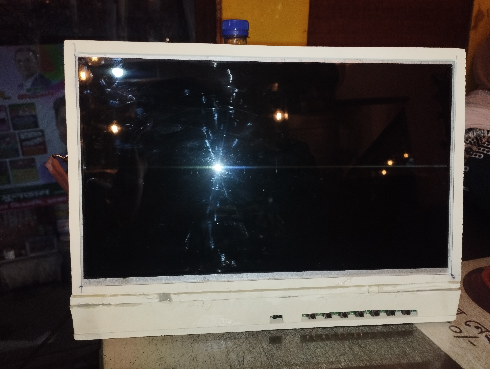
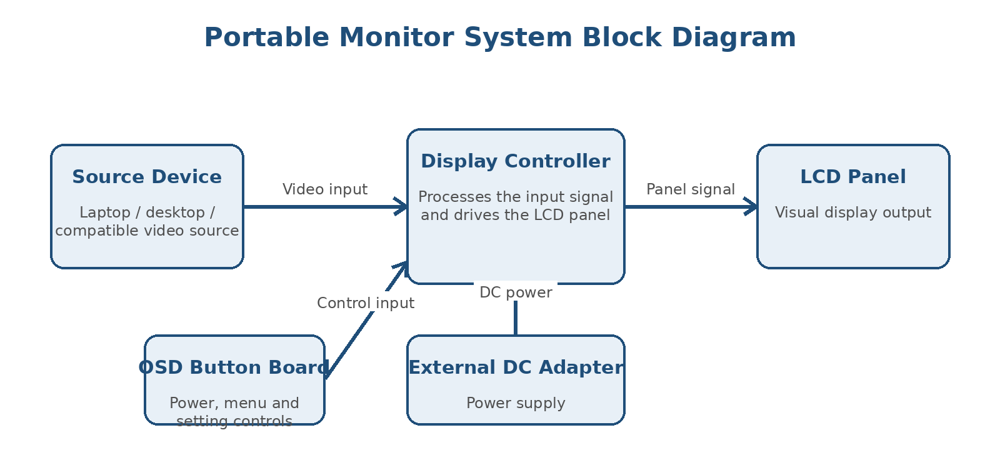
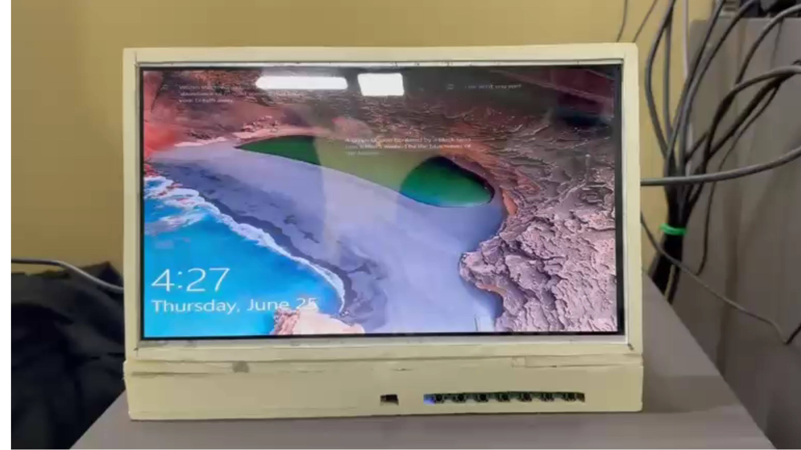
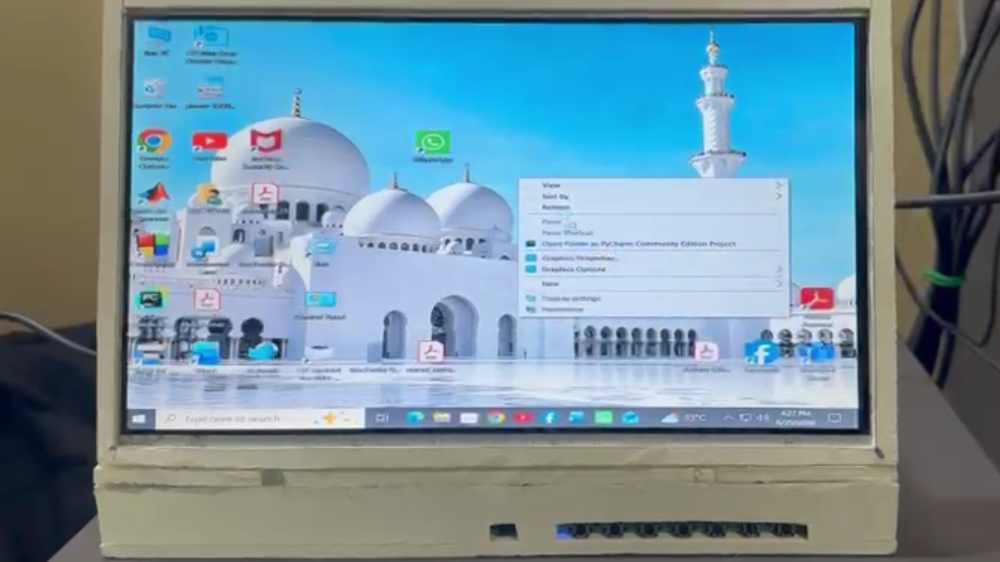

# Design of a Portable Monitor

A low-cost portable monitor prototype developed as an open-ended project for the EEE 406 Microprocessor and Embedded System Laboratory course.

## Project Overview
This portable monitor was developed as a team project. This report focuses on my individual contributions, including component selection, cost analysis, enclosure development, assembly support, testing, and documentation.

## Objectives

- To design a functional portable monitor prototype.
- To select a compatible LCD panel and display driver board.
- To develop a lightweight and low-cost enclosure.
- To test the display output and physical control buttons.
- To analyse the technical and economic feasibility of the project.

## Main Features

- Compact LCD display
- HDMI video input
- Physical OSD control buttons
- Brightness and contrast adjustment
- PVC-board enclosure
- Lightweight and portable design
- Low prototype cost

## Hardware Components

| No. | Component | Quantity | Cost (BDT) |
|---:|---|---:|---:|
| 1 | LCD Display | 1 | 1,650 |
| 2 | Display Driver Board | 1 | 1,700 |
| 3 | Power Adapter | 1 | 100 |
| 4 | PVC Enclosure | 1 | 500 |
| 5 | Cables and Connectors | 1 set | 90 |
| 6 | Transportation | — | 800 |
|  | **Total Cost** |  | **4,820** |

## System Block Diagram

## Working Principle

A laptop or another source device sends a video signal to the display driver board through an HDMI cable. The driver board processes the input signal and controls the LCD panel. The power adapter supplies power to the driver board and display. The OSD buttons allow the user to control power, brightness, contrast, volume, menu options, and input selection.

## Prototype Images

### Front View

### Internal Connection

    

### Final Output

    

## Documentation

- [Portable Monitor Report](docs/DESIGN-AND-DEVELOPMENT-OF-APORTABLE-MONITOR.pdf)
- [Bill of Materials](data/bill-of-materials.csv)
- [Test Results](data/test-results.csv)

## Repository Structure

